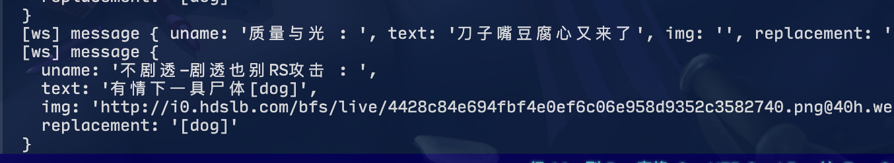

<div align="center">
    
    <h1>Ayase</h1>
    <p>A userscript + websocket server to observe and record Bilibili live danmakus.</p>
</div>

## Usage

1. Download userscript from [release](https://github.com/Vincent-the-gamer/ayase/releases) or from greasyfork(to be uploaded soon).
2. Clone this project, and:
```shell
cd ayase-server

# build your own nitro server, and you'll get an .output folder
pnpm run build

# start your server
NITRO_PORT=xxxx node .output/server/index.mjs"
```
3. Open any Bilibili live room, set your server address, then the userscript will automatically send the danmaku to your websocket server.


## Preview



## License

[MIT License](./LICENSE.md)

Copyright (c) 2025-present Vincent-the-gamer